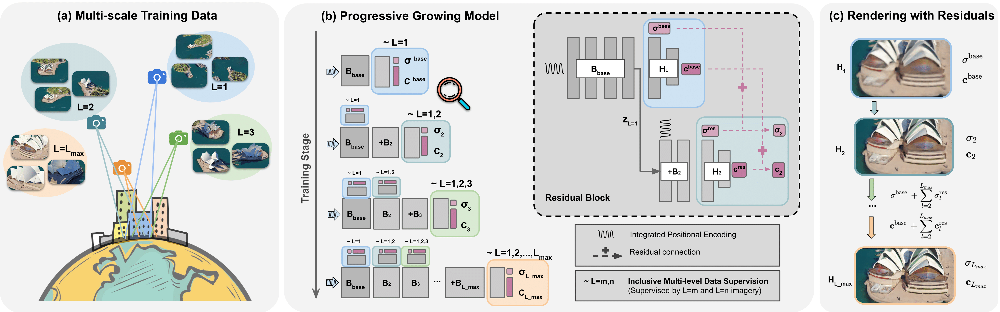
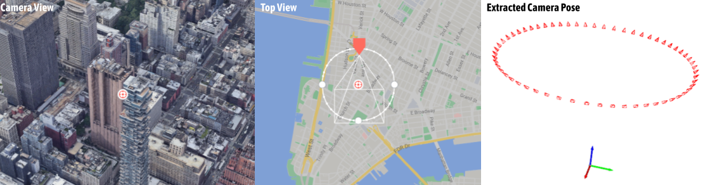

# BungeeNeRF
This repository contains the code release for
[BungeeNeRF: Progressive Neural Radiance Field for Extreme Multi-scale Scene Rendering](https://city-super.github.io/citynerf/img/BungeeNeRF_ECCV22.pdf), aka [CityNeRF](https://city-super.github.io/citynerf/).



## Abstract
Neural Radiance Field (NeRF) has achieved outstanding performance in modeling 3D objects and controlled scenes, usually under a single scale. 
In this work, we focus on multi-scale cases where large changes in imagery are observed at drastically different scales. 
This scenario vastly exists in real-world 3D environments, such as city scenes, with views ranging from satellite level that captures the overview of a city, 
to ground level imagery showing complex details of an architecture; 
and can also be commonly identified in landscape and delicate minecraft 3D models. 
The wide span of viewing positions within these scenes yields multi-scale renderings with very different levels of detail,
which poses great challenges to neural radiance field and biases it towards compromised results. 
To address these issues, we introduce BungeeNeRF, a progressive neural radiance field that achieves level-of-detail rendering across drastically varied scales. 
Starting from fitting distant views with a shallow base block, as training progresses, new blocks are appended to accommodate the emerging details in the increasingly closer views. 
The strategy progressively activates high-frequency channels in NeRF’s positional encoding inputs and successively unfold more complex details as the training proceeds.
We demonstrate the superiority of BungeeNeRF in modeling diverse multi-scale scenes with drastically varying views on multiple data sources (city models, synthetic, and drone captured data) and its support for high-quality rendering in different levels of detail.

## Installation
We recommend using [Anaconda](https://www.anaconda.com/products/individual) to set
up the environment. Run the following commands:

```
git clone https://github.com/city-super/BungeeNeRF.git; cd BungeeNeRF
conda create --name bungee python=3.7; conda activate bungee
conda install pip; pip install --upgrade pip
pip install -r requirements.txt
mkdir data
```

## Data
Two pre-processed data can be download from: [Google Drive](https://drive.google.com/drive/folders/1ybq-BuRH0EEpcp5OZT9xEMi-Px1pdx4D?usp=sharing). Unzip `multiscale_google_56Leonard.zip` and `multiscale_google_Transamerica.zip` to `data` dir. These two folders contain rendered images and processed camera poses. We also offer two .eps files that can be loaded into [Google Earth Studio](https://earth.google.com/studio/). You can adjust camera trajectory and render the most updated views for yourself. The appearance of cities are always updated in GES :). We recommend reading [3D Camera Export](https://earth.google.com/studio/docs/advanced-features/3d-camera-export/) and [FAQs](https://www.google.com/earth/studio/faq/) for camera configuration and permitted usages.



<details>
<summary> Exported 3D tracking data (.json) format </summary>                                                                                    
{"name": xxxx,
"width": xxxx,
"height": xxxx,
"numFrames": xxxx,
"durationSeconds": 56.3,
"cameraFrames": [
        {
            "position": {
                "x": xxx,
                "y": xxx,
                "z": xxx
            },
            "rotation": {
                "x": xxx,
                "y": xxx,
                "z": xxx
            },
            "coordinate": {
                "latitude": xx,
                "longitude": xx,
                "altitude": xxx
            },
            "fovVertical": xx
        },
        ...
    ],
"trackPoints": []}
</details>


Some notes on processing camera poses exported from Google Earth Studio:
* Use the local coordinate when exporting the .json file (i.e. [ECEF coordinate system](http://dirsig.cis.rit.edu/docs/new/coordinates.html)) by setting a track point at the center of the scene. The "position" entry and "rotation" entry give camera poses.
* To get the rotation matrix, use the "rotation" entry in the exported .json file and consider applying `x'=-x, y'=180-y, z'=180+z` to get Euler angles.
* For the ease of computing the ray-sphere intersection of different cities, we further transfer the coordinate to [ENU](http://dirsig.cis.rit.edu/docs/new/coordinates.html) coordinate system. Check out [this](https://github.com/geospace-code/pymap3d/blob/743bb002d5f6ea1a7f788bcebd1ff5f62a66460b/src/pymap3d/ecef.py#L206) function. 
* Scale down the whole scene to lie within a period (e.g. [-pi, pi]) to be effectively represented by the positional encoding.
* H, W, fov can be directly read from the exported .json file and used to compute focal.

Feel free to contact authors if you have any question about the data.


## Running
To run experiments, use:
```
python run_bungee.py --config configs/EXP_CONFIG_FILE
```
The training starts from the furthest scale, with `cur_stage=0`. After an ideal amount of training you can switch to the next training stage by specifying `cur_stage=1`, which will include one finer scale into the training set; and start training from a previous stage checkpoint specified with `--ft_path`:
```
python run_bungee.py --config configs/EXP_CONFIG_FILE --cur_stage 1 --ft_path PREV_CKPT_PATH
```

## Rendering
To render views, use:
```
python run_bungee.py --config configs/EXP_CONFIG_FILE --render_test
```


## Citation
```
@inproceedings{xiangli2022bungeenerf,
    title={BungeeNeRF: Progressive Neural Radiance Field for Extreme Multi-scale Scene Rendering},
    author={Xiangli, Yuanbo and Xu, Linning and Pan, Xingang, and Zhao, Nanxuan and Rao, Anyi and Theobalt, Christian and Dai, Bo and Lin, Dahua},
    booktitle = {The European Conference on Computer Vision (ECCV)}, 
    year={2022}
}
```
